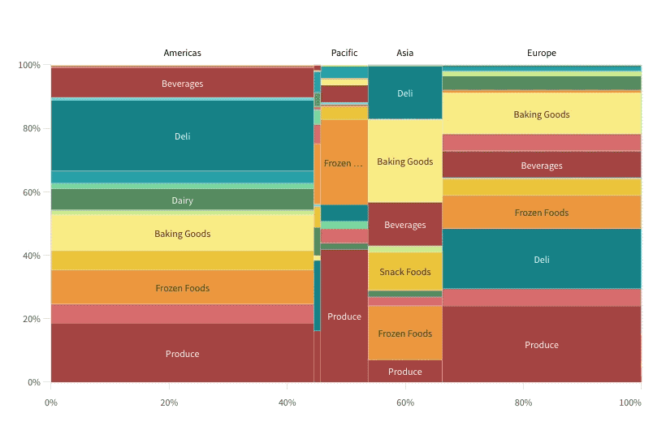

# sn-mekko-chart

[](https://circleci.com/gh/qlik-oss/sn-mekko-chart)
[](https://coveralls.io/github/qlik-oss/sn-mekko-chart)

A basic mekko chart supernova aimed to be used in [nebula.js](https://github.com/qlik-oss/nebula.js).




## Installing

If you use npm: `npm install @nebula.js/sn-mekko-chart`. You can also load through the script tag directly from [https://unpkg.com](https://unpkg.com/@nebula.js/sn-mekko-chart).

## Usage

```js

import { embed } from '@nebula.js/stardust';
import mekko from '@nebula.js/sn-mekko-chart';

// 'app' is an enigma app model
const nuked = embed(app, {
  types: [{ // register the mekko chart
    name: 'mekko',
    load: () => Promise.resolve(mekko);
  }]
});

embed.render({
  element,
  type: 'mekko',
});
```

[See full example](./example)
