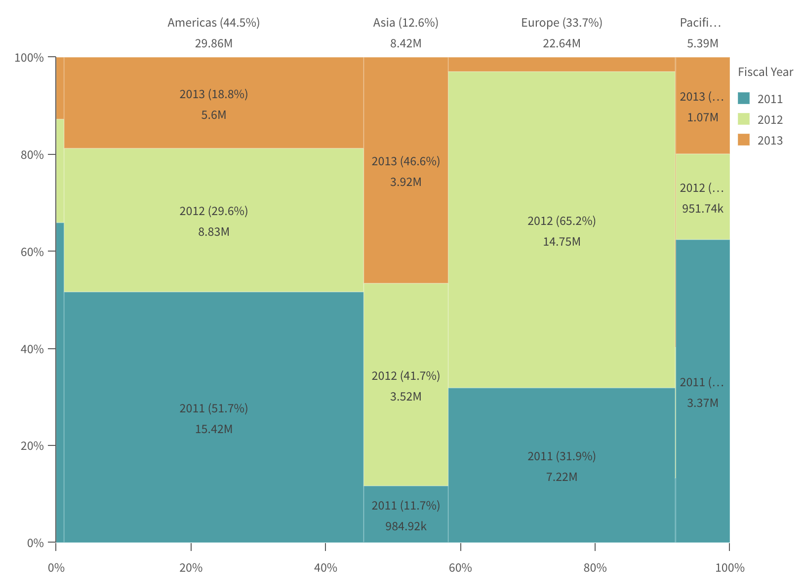

> **Warning** This repository is now archived and will not be updated

> This repository was originally published to foster collaboration and engagement with developers as they customized or developed visualizations, but due to customer feedback and usage data, it is now moved back to closed source. Moving this and other projects back to closed source will support better integration with internal build and test tooling, and free up resources for investment in these and other visualizations.

# sn-mekko-chart

A basic mekko chart supernova aimed to be used in [nebula.js](https://github.com/qlik-oss/nebula.js).



```js

import { embed } from '@nebula.js/stardust';
import mekko from '@nebula.js/sn-mekko-chart';

// 'app' is an enigma app model
const embeddable = embed(app, {
  types: [{ // register the mekko chart
    name: 'mekko',
    load: () => Promise.resolve(mekko);
  }]
});

embeddable.render({
  element,
  type: 'mekko',
  fields: ['Region', 'Fiscal Year', '=Sum(Sales)'],
});
```

## Requirements

Requires `@nebula.js/stardust` version `>=1.7.0`.

## Installing

If you use npm: `npm install @nebula.js/sn-mekko-chart`. You can also load through the script tag directly from any of the CDNs that supports NPM packages, for example: [unpkg](https://unpkg.com/@nebula.js/sn-mekko-chart).

## More examples

### Color by dimension

In this example the first dimension (Region) is used to color each cell.


```js
embeddable.render({
  element,
  type: "mekko",
  fields: ["Region", "Fiscal Year", "=Sum(Sales)"],
  properties: {
    cellColor: {
      mode: "byDimension",
      byDimension: { type: "index", typeValue: 0 },
    },
  },
});
```

## API

The API specifiction is available at [Qlik Developer Portal](https://qlik.dev/apis/javascript/nebula-mekko-chart)
